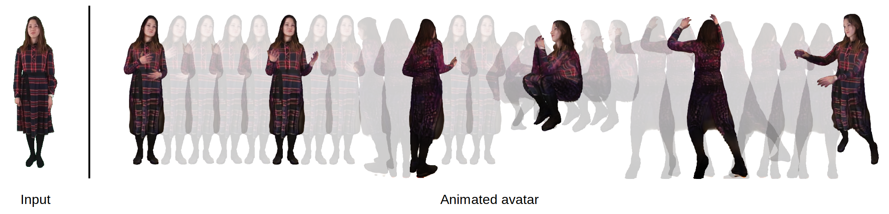

# DINAR: Diffusion Inpainting of Neural Textures for One-Shot Human Avatars


David Svitov, Dmitrii Gudkov, Renat Bashirov, Victor Lempitsky



**Paper:** https://arxiv.org/abs/2303.09375 <br>
**Project page:** https://samsunglabs.github.io/DINAR_project_page/ <br>
**Video:** https://youtu.be/FNWgDsFJ2PY <br>

**Abstract:**  *We present DINAR, an approach for creating realistic rigged fullbody avatars from single RGB images. Similarly to previous works, our method uses neural textures combined with the SMPL-X body model to achieve photo-realistic quality of avatars while keeping them easy to animate and fast to infer. To restore the texture, we use a latent diffusion model and show how such model can be trained in the neural texture space. The use of the diffusion model allows us to realistically reconstruct large unseen regions such as the back of a person given the frontal view. The models in our pipeline are trained using 2D images and videos only. In the experiments, our approach achieves state-of-the-art rendering quality and good generalization to new poses and viewpoints. In particular, the approach improves state-of-the-art on the SnapshotPeople public benchmark.* 

---
## Installation

The easiest way to build an environment for this repository is to use docker image. To build it, make the following steps:
1. Build the image with the following command:
```
bash docker/build.sh
```
2. Start a container:
```
bash docker/run.sh
```
It mounts root directory of the host system to `/mounted/` inside docker and sets cloned repository path as a starting directory.
3. **Inside the container** install `minimal_pytorch_rasterizer`. (Unfortunately, docker fails to install it during image building)
```
pip install git+https://github.com/rmbashirov/minimal_pytorch_rasterizer
```
4. *(Optional)* You can then commit changes to the image so that you don't need to install  `minimal_pytorch_rasterizer` for every new container. See [docker documentation](https://docs.docker.com/engine/reference/commandline/commit/).


---
## Inference

To get one-shot human avatar with your images:
1. Prepare data:

Dataset folder structure:

    .
    ├── rgb                   # *.png images of humans
    ├── segm                  # *.png segmentation masks generated by https://github.com/Gaoyiminggithub/Graphonomy
    ├── openpose              # *.json files with keypoints generated by https://github.com/CMU-Perceptual-Computing-Lab/openpose
    └── smplx                 # body parameters trained with modification of https://github.com/vchoutas/smplify-x

Check SnapshotPeople prepared [data](https://drive.google.com/file/d/1JTlSvW4jjLApIeDL18AAnW3RQ4pMaP49/view?usp=sharing) for example.

Rendered examples of SnapshotPeople avatars for [front](https://drive.google.com/file/d/1kaS_4w-3vXWBDnR8L6uCnlIe1LcbQzq2/view?usp=sharing) and [back](https://drive.google.com/file/d/1HK4PDPsROlQ4U4IRfihI3x5TKi82_X_j/view?usp=sharing) views.

2. Download: 
   * [Checkpoint](https://drive.google.com/file/d/1btN1With9w1S4cd_zaO8eN_jI3-87Wyh/view?usp=sharing) 
   * [SMPL-X models](https://smpl-x.is.tue.mpg.de/download.php) and put them to the ```./smplx_data/smplx_models```
   * [Animation sequence](https://drive.google.com/file/d/12VhGqdl4egrPWWWzXW9k7cwgJKxgv9t2/view?usp=sharing) and put it to the ```./smplx_data/```

3. Launch the script:
```
python inference.py \
 --ckpt_path=checkpont/path/filename.ckpt \
 --log_dir=path/to/logs \
 --data_root=path/to/your/data 
```
Example:
```
python inference.py \
 --ckpt_path=./checkponts/ddpm-epoch=24.ckpt \
 --log_dir=./logs \
 --data_root=./Dataset/SnapshotPeople 
```

Look for result video in ```<log_dir>/eval/<exp_name>/textures/video```

---
## Citation
```
@article{svitov2023dinar,
  title={DINAR: Diffusion Inpainting of Neural Textures for One-Shot Human Avatars},
  author={Svitov, David and Gudkov, Dmitrii and Bashirov, Renat and Lemptisky, Victor},
  journal={arXiv preprint arXiv:2303.09375},
  year={2023}
}
```